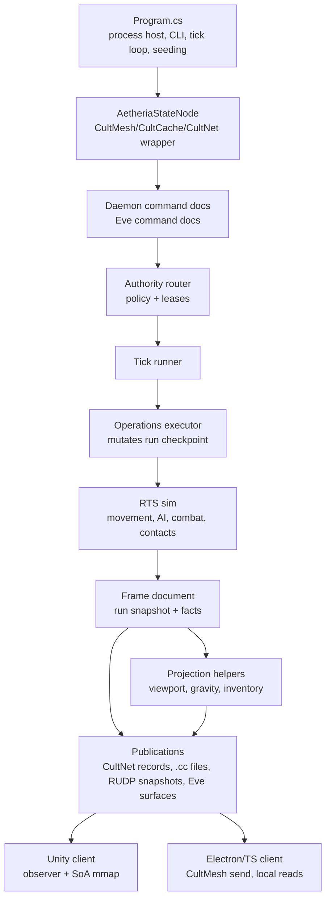
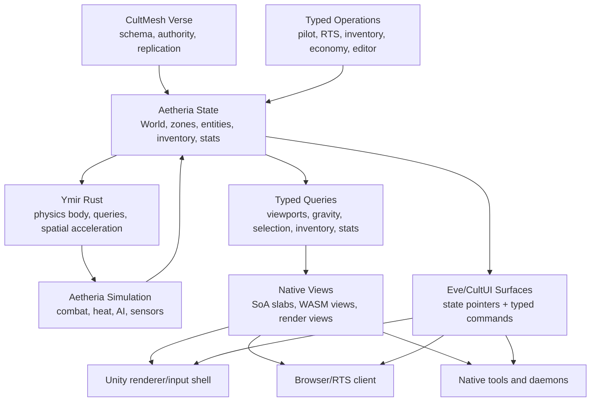

# Aetheria Daemon Code Map for Rust Rebuild

This is a map of the current C# daemon as a reference API to document, measure, and deprecate before the rebuild. This is not an Agile migration plan and not a request to preserve the current architecture. The C# code is the shakedown cruise: it taught us where Unity, TS, browser, Eve/CultUI, Rust, and native clients need clean CultMesh ergonomics, where the daemon leaked local-process assumptions, and where the API wants to become magical instead of merely serviceable.

The rebuild target is a clean cross-runtime Aetheria surface: a Rust-native daemon and Ymir body, with useful abstractions hoisted into CultMesh/CultLib so typed state, operations, queries, native slices, authority, and UI state pointers are shared library primitives. Clients should feel like they are holding reactive, native Aetheria state, not hand-pulling snapshots, decoding array slots, reading local publication files, or building bespoke command packets.

This also means Ymir needs a Rust body. Aetheria cannot become a Rust-native simulation daemon while physics remains a C# or Unity-shaped side service. The C# Ymir contracts and Unity bridge are useful reference material, but the rebuilt daemon needs Rust Ymir beside it as the authoritative physics library/service.

## Rebuild Doctrine

1. Document the current C# daemon API and client behavior.
2. Measure it as the deprecated compatibility reference.
3. Build the daemon and client semantics in the shape we actually want, then hoist reusable abstractions into CultMesh/CultLib instead of trapping them in Aetheria glue.
4. Let Unity, TS, browser, native, Eve/CultUI, Rust, and future runtimes consume the same typed Verse semantics.
5. Use this rebuild to make CultMesh expansive: cozy managed developer experience on top, very fast cross-runtime primitives underneath.

Compatibility means the new cross-runtime surface can understand enough of the old contract to migrate clients and compare intentional behavior. It does not mean the new architecture inherits old seams, and it does not mean client APIs keep their current awkward shape.

The test for a good abstraction is whether it belongs to Aetheria or to CultMesh. If a pattern is useful to any daemon with typed state, reactive UI surfaces, native view sharing, authority routing, or colocated query execution, it should move up into the shared cross-runtime library layer.

The concrete shared-layer target is tracked in `Aetheria.State/docs/cultmesh-cross-runtime-primitives.md`. Treat that note as the CultMesh/CultLib primitive checklist for this rebuild: Aetheria proves the shape, but the reusable machinery belongs in the cross-runtime library layer.

## Current C# Shape



The current daemon is one C# executable around a CultMesh node. It ensures seed documents, reads typed command documents, authorizes them, applies operations, steps a compact RTS sim, publishes a new frame, and emits several secondary publications for clients.

That shape proved the core idea, but it also leaked implementation details into every edge:

- Unity observes daemon state through a C# facade and memory-mapped SoA view.
- Electron sends CultMesh commands but still reads local `.cc` publications.
- TS duplicates projection logic by decoding MessagePack arrays and slot constants.
- RUDP snapshot handling injects ad hoc viewport projection records.
- Eve/CultUI surface generation is mixed into daemon publication.
- The host loop seeds scenario content and durable docs directly.
- The API is typed in places, but not magical enough: clients still know too much about transport, record keys, snapshots, and projection plumbing.

## Measured C# API Surface

These files define the deprecated reference surface. They should be treated as API documentation and shakedown evidence first, not as design inspiration or strict parity law.

| Area | Source | What to freeze |
| --- | --- | --- |
| Host behavior | `Aetheria.State.Daemon/Program.cs` | CLI options, startup behavior, seed behavior, tick cadence, RUDP endpoint behavior, remote fact import behavior. |
| CultMesh node wrapper | `Aetheria.State/AetheriaStateNode.cs` | Current record reads/writes, observed command query behavior, flush semantics. |
| Registry | `Aetheria.State/AetheriaDocumentRegistry.cs` | C# document set currently exposed through CultCache/CultNet. |
| Replica sync | `Aetheria.State/AetheriaVerseReplica.cs` | Scoped snapshot fetch, document fetch, remote committed fact import dependency. |
| Local publications | `Packages/org.gamecult.aetheria.state/Runtime/AetheriaRuntimeCultCacheDocumentStore.cs` | `.cc` compatibility files and their payload layout. |
| Daemon documents | `Packages/org.gamecult.aetheria.state/Runtime/AetheriaRuntimeDaemonDocuments.cs` | Schema ids, command enum, frame, command, committed fact, viewport, health, provider, command boundary, surface docs. |
| Snapshot documents | `Packages/org.gamecult.aetheria.state/Runtime/AetheriaRuntimeSnapshotDocuments.cs` | Run, zone, entity, body, equipment, cargo, loadout, stat grids. |
| Authority documents | `Packages/org.gamecult.aetheria.state/Runtime/AetheriaRuntimeVerseAuthorityPolicy.cs` | Policy, rules, leases, modes, roles, deployment vocabulary, current authorization decisions. |
| SoA documents | `Packages/org.gamecult.aetheria.state/Runtime/AetheriaRuntimeDaemonSoaDocuments.cs` | SoA backends, sync modes, column ids, dirty ranges, render groups. |
| Command application | `Packages/org.gamecult.aetheria.state/Runtime/AetheriaRuntimeDaemonOperations.cs` | Current meaning of every gameplay command and rejection. |
| Tick composition | `Packages/org.gamecult.aetheria.state/Runtime/AetheriaRuntimeDaemonTickRunner.cs` | Current order of command filtering, operation execution, sim step, frame creation, publication payloads. |
| Compact sim | `Packages/org.gamecult.aetheria.state/Runtime/AetheriaRuntimeRtsSimulation.cs` | Existing movement, hostile AI, combat, heat, and contact rules. |
| Projections | `Packages/org.gamecult.aetheria.state/Runtime/AetheriaRuntimeRtsProjection.cs` | Existing map, object, gravity, selected object, docking, refit, sector, and inventory projections. |
| Client facade | `Packages/org.gamecult.aetheria.state/Runtime/AetheriaClient.cs` | C# client observation and typed operation ergonomics. |
| Verse client | `Packages/org.gamecult.aetheria.state/Runtime/AetheriaRuntimeVerseClient.cs` | Current lower-level typed document reads/watches and command submission. |
| Operation builders | `Packages/org.gamecult.aetheria.state/Runtime/AetheriaRuntimeDaemonOperationClient.cs` and `AetheriaRuntimeDaemonOperationsClient.cs` | Existing typed operation vocabulary. |
| Eve bridge | `Aetheria.State/AetheriaEveCommandBridge.cs` | Existing Eve command acceptance behavior for settings, catalog, policies, and surfaces. |
| Unity consumption | `Assets/Scripts/Gameplay/AetheriaDaemonObserver.cs` | Current Unity daemon observation, SoA remapping, and render native view handoff. |
| TS consumption | `Aetheria.Rts.Web/Electron/aetheria-cultmesh.ts`, `aetheria-rts-local-projection.ts`, `aetheria-local-publication-reader.ts` | Current Electron command sending, local publication reading, and duplicated projection behavior. |
| Ymir C# contracts | `Assets/Scripts/ServerShared/YmirPhysicsContracts.cs` | Current body/world/query DTOs plus reference implementation for step, overlap, and cast queries. |
| Ymir Unity bridge | `Assets/Scripts/Gameplay/Physics/AetheriaYmirPhysicsBridge.cs` | Current Unity presentation adapter that posts JSON to Ymir endpoints and maps daemon SoA bodies into Ymir query worlds. |
| Ymir query tests | `Assets/Scripts/Tests/YmirPhysicsQueryTests.cs` | Current expectations for integration, radial fields, contacts, overlap sphere/circle, and cast sphere/circle; useful semantics should survive, DTO/endpoint shape should not. |

## Current Control Flow

The C# host does this today:

1. Parse `AetheriaDaemonHostOptions`.
2. Open `AetheriaStateNode` with a CultMesh node, CultCache registry, and CultNet registry.
3. Ensure baseline world, trade policy, playable run, Starbridge scenario/session, verse host settings, and authority policy.
4. Publish runtime session and Eve surfaces.
5. Start a loopback CultNet RUDP server for RTS clients.
6. Tick immediately, then tick by interval:
   - Accept Eve commands.
   - Choose next frame id and simulation time.
   - Resolve current run from previous frame or durable documents.
   - Read loadout templates, daemon commands, authority policy, Starbridge state, and leases.
   - Filter commands through authority rules.
   - Execute daemon operations.
   - Step the compact RTS sim.
   - Build a daemon frame.
   - Publish committed command facts.
   - Import remote committed command facts.
   - Publish frame, health, command boundary, provider docs, Starbridge summary, SoA view, and Eve surfaces.

This is behavior to measure and learn from. It is not the desired architecture.

## Current Public Data Contract

The Rust daemon must be able to read or bridge these old records during deprecation:

| Record | Current key |
| --- | --- |
| Provider advertisement | `daemon:aetheria.provider_advertisement.v1` |
| Health | `daemon:aetheria.health.v1` |
| Command boundary | `daemon:aetheria.command_boundary.v1` |
| Latest frame | `daemon:aetheria.frame.latest.v1` |
| Latest SoA view | `daemon:aetheria.soa_view.latest.v1` |
| Starbridge scenario | `starbridge:aetheria.scenario.latest.v1` |
| Starbridge session | `starbridge:aetheria.session.latest.v1` |
| Game Eve surface | `eve:surface:aetheria.daemon.game` |
| Game Eve TUI surface | `eve:surface:aetheria.daemon.game.tui` |
| Editor Eve surface | `eve:surface:aetheria.daemon.editor` |
| Editor Eve TUI surface | `eve:surface:aetheria.daemon.editor.tui` |
| Daemon command | `daemon:commands:{stable-command-id}:gamecult.aetheria.daemon_command.v1` |
| Eve command | `eve:commands:{stable-command-id}:gamecult.eve.command.v1` |

Current schema roots:

| Contract | Source |
| --- | --- |
| Daemon command/frame/fact/projection/provider/health/boundary/surface docs | `AetheriaRuntimeDaemonDocuments.cs` |
| Runtime run/zone/entity/body/equipment/cargo/loadout docs | `AetheriaRuntimeSnapshotDocuments.cs` |
| SoA view docs and columns | `AetheriaRuntimeDaemonSoaDocuments.cs` |
| Authority policies and leases | `AetheriaRuntimeVerseAuthorityPolicy.cs` |
| Eve command docs | `AetheriaRuntimeEveCommandDocument.cs` |

## Current Gameplay Command Vocabulary

These are the gameplay operations exposed by the C# command document. The Rust rebuild should re-express them as typed native operations, not as public stringly transport calls.

| Area | Commands |
| --- | --- |
| Targeting | `SetTarget`, `ClearTarget`, `TargetNearest`, `TargetNext`, `TargetPrevious`, `TargetReticle` |
| Pilot control | `SetMoveVector`, `SetLookDirection`, `SetTractorPower` |
| Combat and equipment | `FireWeaponGroup`, `SetWeaponGroupActive`, `SetWeaponGroupMembership`, `SetBehaviorActive`, `ActivateConsumable`, `SensorPing`, `SetHeatsinksEnabled`, `SetOverrideShutdown`, `SetShutdownPerformance`, `SetItemEnabled`, `ToggleShieldEnabled`, `SetItemOverrideShutdown`, `SetThermotoggleTargetTemperature` |
| Inventory, refit, economy | `TransferCargoItem`, `EquipItem`, `StoreItem`, `PickUpLoot`, `TradePurchase`, `RestoreLoadout`, `SetDockedCurrentShip` |
| Interaction and travel | `Dock`, `DockNearest`, `Undock`, `Interact`, `EnterWormhole`, `TowToStation` |
| Metadata and destruction | `SetEntityName`, `DestroyEntity`, `ToggleHullConductivity` |

## Rust Daemon Perfect Shape

The Rust daemon should be designed around typed state, typed operations, reactive subscriptions, and a Rust-native Ymir physics body.



Desired properties:

- A client can ask for typed state or a typed projection without knowing record-key plumbing.
- A client can submit a typed operation without constructing transport payloads.
- A UI surface can point at daemon state and let the CultUI runtime resolve it automatically.
- Unity receives native render views and typed state handles, not gameplay ownership.
- Browser clients can run as observers, controllers, or simulation hosts depending on Verse authority configuration.
- The daemon owns simulation and projections as state-native behavior, not as publication side effects.
- Ymir owns physical truth in Rust: stepping, overlaps, casts, contacts, broadphase, and spatial query acceleration.
- CultMesh authority is explicit per Verse, with server-authoritative, trusted distributed, lease, quorum, and browser/WASM host structures remaining open.

## Ymir Rust Body

Ymir should be rebuilt as a Rust-native physics foundation used by Aetheria, Unity, browser/WASM, and future runtimes. Its current C# implementation is behavior evidence, not the long-term body and not strict parity law.

Current Ymir shape:

| Area | Current source | Notes |
| --- | --- | --- |
| Contracts and reference implementation | `Assets/Scripts/ServerShared/YmirPhysicsContracts.cs` | Defines `YmirWorld`, `YmirPhysicsBody`, radial fields, contacts, 2D circle queries, 3D sphere queries, and reference step/query math. |
| Unity adapter | `Assets/Scripts/Gameplay/Physics/AetheriaYmirPhysicsBridge.cs` | Converts Unity/daemon render views into Ymir request DTOs and posts JSON to local query endpoints. This is presentation glue, not future architecture. |
| Tests | `Assets/Scripts/Tests/YmirPhysicsQueryTests.cs` | Current checks for stepping, radial fields, overlap/cast ordering, contact output, and invalid input handling. |

The initial freeze exporter now emits `ymir-queries` probes from the current C# implementation: step integration, radial field acceleration, contact separation, overlap circle/sphere sorting, cast circle/sphere hits, and invalid-input behavior. These are typed measurement probes with explicit vector, world, body, field, hit, and contact records in JSON plus MessagePack. The next version should expand them with CultMath-shaped rect, circle, sphere, broadphase, sparse-cluster, and viewport-intersection fixtures.

Rust Ymir should provide:

- canonical `Vec2`, `Vec3`, `Rect`, `Circle`, `Sphere`, and body handles from CultMath-compatible primitives
- deterministic step for Aetheria body motion
- contacts and collision response for gameplay authority
- `overlap_circle`, `cast_circle`, `overlap_sphere`, `cast_sphere`
- viewport/intersection queries for gravity brushes and render/query visibility
- sparse-cluster-friendly broadphase and spatial acceleration
- SoA-friendly body storage that can be viewed by Aetheria and render clients
- WASM-compatible query and step surface
- CultMesh-friendly typed query/operation bindings where a runtime can ask for physical facts without knowing transport details

The C# JSON endpoint shape should be understood only for migration and comparison. The Rust API should feel native:

```rust
let hits = ymir
    .world(zone_id)
    .overlap_sphere(Sphere::new(center, radius))
    .filter(FactionMask::hostile_to(actor))
    .collect();
```

That is the bar. Unity can keep a bridge for click affordances and presentation, but physical truth belongs to Rust Ymir and is consumed by Aetheria through typed state/query handles.

## CultMesh Ergonomic Lessons

See `Aetheria.State/docs/cultmesh-cross-runtime-primitives.md` for the expanded primitive design, ownership boundary, code-shape examples, and performance contract. This section is the short form kept inside the daemon map.

Aetheria exposed where CultMesh should become more magical:

| Current leak | Better CultMesh shape |
| --- | --- |
| Clients manually know record keys. | CultMesh provides generated typed document handles and query handles. |
| TS decodes MessagePack arrays by slot constants. | CultMesh provides generated typed TS/Rust/C#/WASM bindings with transparent encode/decode. |
| Commands are documents pushed to known records. | CultMesh provides typed Verse operations with transport chosen by runtime. |
| Local `.cc` files are used as client read path. | CultMesh subscriptions and scoped queries are the read path. |
| Viewport projections are injected into snapshot responses. | CultMesh supports first-class typed query surfaces for derived state. |
| Eve surfaces require manual state-ref resolution. | CultUI/CultMesh surface props can hold typed state pointers resolved by the runtime. |
| Unity needs special observer glue. | CultMesh gives Unity the same typed state handles plus native render views. |
| SoA view sharing is daemon-specific. | CultCache/CultMesh exposes typed native slices where co-location allows it. |
| Authority logic is app-specific glue. | CultMesh exposes reusable authority policy, lease, claim, and runtime-role primitives. |
| Colocated services still use bespoke endpoints. | CultMesh routes typed local calls, remote calls, WASM calls, and shared-memory/native-slice access behind one semantic API. |

This rebuild should feed back into CultMesh itself. If Aetheria needs a hand-written adapter to do an obvious typed-state thing, that is probably a missing CultMesh primitive. The target is managed and cozy for the developer, but not soft underneath: the runtime should still pick the fastest available path, whether that is an in-process view, a shared CultCache slab, a WASM view, or a remote Verse route.

### CultMesh Primitives To Hoist

These are not Aetheria conveniences. They are shared library capabilities that should make future daemons feel native from every runtime:

| Primitive | Shared capability |
| --- | --- |
| Typed document handles | Generated handles for records, schema ids, keys, subscriptions, and mutations. |
| Typed operation handles | Method-shaped operations with generated payloads, authority metadata, routing, idempotency, and acknowledgements. |
| Typed query surfaces | Composable derived-state queries that can run colocated, remote, or WASM without changing client code. |
| Reactive state pointers | Values that UI surfaces can hold directly, with automatic resolution, invalidation, and subscription lifetimes. |
| Native slice views | Safe typed views over CultCache/SoA slabs for Unity jobs, Rust, native clients, and WASM memory where possible. |
| Authority primitives | Reusable policy modes, leases, claims, runtime roles, and future quorum/consensus hooks. |
| Geometry/math values | Shared `Vec2`, `Vec3`, `Rect`, `Circle`, `Sphere`, transforms, and deterministic scalar helpers. |
| Locality-aware routing | Runtime chooses shared-memory, in-process, IPC, network, or WASM transport while the API remains semantic. |
| Schema evolution | Generated migration manifests, compatibility readers, and versioned operation/query contracts. |
| Surface bindings | Eve/CultUI components bind to typed state handles and operation handles instead of string refs and command names. |

### Sugar Targets

These examples are aspirational API targets. They are not promises about exact names; they show how little transport code a client should need to express ordinary Aetheria work.

Current TS RTS client command path:

```ts
const commandId = crypto.randomUUID();
const issuedAtUtc = new Date().toISOString();
await client.sendCommandDocument(
  commandId,
  issuedAtUtc,
  encodeSetMoveVectorCommand(commandId, issuedAtUtc, runtimeId, {
    actorEntityKey,
    directionX,
    directionY,
    scalarValue,
  }));
```

Desired TS CultMesh operation sugar:

```ts
await verse
  .aetheria()
  .entity(actor)
  .pilot()
  .move({ direction: vec2(x, y), throttle });
```

Current TS projection path:

```ts
const frame = await publications.readDaemonFrame();
const objects = projectObjectsViewportFromFrame(frame, {
  minX,
  minY,
  maxX,
  maxY,
  controlledEntityIndices,
});
```

Desired TS query sugar:

```ts
const objects = await verse
  .aetheria()
  .zone(zoneId)
  .objects()
  .visibleTo(controlledUnits)
  .within(rect.xy(min, max))
  .watch();
```

Current Unity observation path:

```csharp
var observed = ResolveClient().ObserveAsync().GetAwaiter().GetResult();
if (observed != null && observed.HasSoaView)
{
    AetheriaDaemonSoaMemoryMap.TryOpen(observed.SoaIndex, out var map, out _);
    AetheriaDaemonRenderNativeView.TryCreate(observed.SoaIndex, map, out var view);
}
```

Desired Unity renderer sugar:

```csharp
await foreach (var view in verse
    .Aetheria()
    .CurrentZone()
    .RenderView()
    .AsNativeArrays())
{
    ShipRenderJobs.Schedule(view.Entities);
}
```

Current Ymir query bridge shape:

```csharp
var request = new YmirCircleOverlapRequest
{
    world = world,
    center = ToVec2(center),
    radius = radius
};
var hits = PostJson<YmirCircleOverlapRequest, YmirCircleOverlapResult>(OverlapCircleUrl, request).hits;
```

Desired Rust Ymir/Aetheria query sugar:

```rust
let hits = verse
    .aetheria()
    .zone(zone)
    .physics()
    .overlap_circle(Circle::new(center, radius))
    .exclude(actor)
    .collect()
    .await?;
```

Current Eve surface state-ref resolution:

```csharp
using var client = await AetheriaClient.OpenAsync(statePath, runtimeId);
var resolver = client.State.CreateEveSurfaceStateRefResolver();
var label = resolver("aetheria.daemon/frame/currentEntity/name");
```

Desired CultUI state pointer sugar:

```ts
surface.label({
  text: verse.aetheria().currentEntity().name,
});

surface.button({
  icon: "crosshair",
  command: verse.aetheria().currentEntity().targetNearest,
});
```

Current C# operation facade is close, but still hides snapshot/transport setup behind a Unity-owned observer:

```csharp
observer.Operations.SetTarget(targetEntityKey);
observer.Operations.FireWeaponGroup(0);
```

Desired cross-runtime typed operation sugar:

```csharp
await verse.Aetheria()
    .Entity(actor)
    .Combat
    .Target(target)
    .Fire(group: 0);
```

Current refit/economy fixture shape:

```csharp
command.TextValue = "repair-parts";
command.CargoTransfer.OriginEntityKey = station;
command.CargoTransfer.OriginCargoIndex = 0;
command.CargoTransfer.DestinationEntityKey = actor;
command.CargoTransfer.DestinationCargoIndex = 0;
command.CargoTransfer.SourceX = 0;
command.CargoTransfer.SourceY = 0;
command.CargoTransfer.DestinationX = 2;
command.CargoTransfer.DestinationY = 0;
command.CargoTransfer.HasDestinationPosition = true;
```

Desired inventory operation sugar:

```ts
await verse
  .aetheria()
  .entity(actor)
  .inventory()
  .cargo()
  .takeFrom(station.inventory().cargo())
  .item("repair-parts")
  .placeAt(grid(2, 0));
```

Desired trade sugar:

```rust
verse
    .aetheria()
    .entity(actor)
    .inventory()
    .buy_from(station)
    .item("reactor-fuel")
    .quantity(1)
    .place_in(CargoBay::primary())
    .await?;
```

The common pattern: state access starts from a typed Verse handle, operations hang from typed state objects, queries compose like native collections, and subscriptions return reactive state or native views. Record keys, schema ids, endpoint selection, MessagePack slots, command ids, and local/remote routing are CultMesh runtime concerns.

## Deprecation Boundary

The C# daemon becomes deprecated when these artifacts exist:

1. A written measurement snapshot of current schemas, record keys, operation meanings, client semantics, and projection outputs.
2. Migration probe fixtures for:
   - seeded run state
   - command batches
   - authority acceptance/rejection
   - post-tick frames
   - objects viewport
   - gravity viewport
   - selected object
   - inventory
   - SoA view descriptor
3. A Rust daemon design that does not inherit local publication files, TS projection duplication, Unity coordinate leakage, or host-loop scenario seeding.
4. A CultMesh ergonomic checklist identifying shared cross-runtime primitives to hoist before the daemon and clients harden around local adapters. The detailed checklist lives in `Aetheria.State/docs/cultmesh-cross-runtime-primitives.md`.

After that, the C# daemon should be deprecated except for critical migration fixes.

The concrete artifact and fixture checklist lives in `Aetheria.State/docs/rust-rebuild-freeze-checklist.md`.

## Rust Rebuild Modules

These are product-shape modules, not incremental migration slices:

| Module | Responsibility |
| --- | --- |
| `aetheria_schema` | Canonical schemas, generated bindings, record/query/operation identities, and legacy MessagePack migration support. |
| `aetheria_world` | World, zones, entities, bodies, inventory, loadouts, stats, keys, deterministic state layout. |
| `aetheria_authority` | Verse authority policies, leases, roles, claims, and runtime participation rules. |
| `aetheria_ops` | Typed gameplay operations and validation. |
| `ymir_math` | CultMath-compatible vectors, rects, circles, spheres, transforms, deterministic scalar helpers. |
| `ymir_physics` | Rust-native bodies, fields, broadphase, stepping, contacts, overlap/cast queries, spatial acceleration. |
| `aetheria_sim` | Aetheria rules over Ymir physics: combat, heat, AI, sensors, stat evaluation, deterministic tick logic. |
| `aetheria_query` | First-class typed queries for objects viewport, gravity viewport, current object, inventory, stats, Starbridge state, and client-visible sets. |
| `aetheria_views` | SoA/native/WASM render views, dirty ranges, and cross-runtime native slice semantics. |
| `aetheria_surfaces` | Eve/CultUI state-backed surfaces, state pointer resolution, and operation bindings. |
| `aetheria_host` | Native daemon process, CultMesh runtime, persistence, authority mode configuration. |
| `aetheria_wasm` | Browser simulation host and query runtime. |

The module boundary should stay honest: Aetheria modules define Aetheria concepts, while CultMesh/CultLib absorbs the general machinery for typed state, generated handles, authority routing, native views, geometry values, reactive surfaces, transport selection, and schema evolution.

## Design Constraints For The New Daemon

- Gameplay plane is XY. Unity XZ conversion belongs in Unity adapters.
- State schema should model vectors and rects as first-class values.
- Ymir primitives should be Rust-first and CultMath-compatible; C# DTOs are compatibility mirrors.
- SoA columns may store vector values as vector columns; they do not need to split every component unless the query actually benefits.
- The simulation receives explicit tick time. Wall clock is publication metadata only.
- Queries are derived state. Clients should ask for what they need: visible objects, gravity influences, stats, inventory, render views.
- Rendering views are not authority. Unity, browser, and native clients consume views and submit typed operations.
- The browser can be a simulation host when authority policy grants it that role.
- Local co-deployment can expose native slices, but remote runtimes must see the same semantic state through CultMesh.
- The new API should make the common path short enough that client code reads like native Aetheria code.

## Things To Bury With The C# Daemon

- Local `.cc` publication files as normal client API.
- C# or Unity-shaped Ymir as the authority path.
- JSON HTTP Ymir calls as the normal in-process/co-deployed path.
- TS projection copies that parse raw MessagePack slots.
- RUDP snapshot projection injection as the query model.
- Unity coordinate debt in shared schema.
- Host-loop seeding as world definition.
- UI surfaces that require external manual state-ref resolution.
- Client code that knows transport boundaries for ordinary state access.
- Any public `Apply(command, payload)` style operation surface.

## First Rebuild Milestone

The first Rust milestone should demonstrate the final shape, not a half-port:

1. Define canonical schema and hoisted CultMesh primitives for Rust, TS, Unity/C#, browser/WASM, and Eve/CultUI, using `Aetheria.State/docs/cultmesh-cross-runtime-primitives.md` as the shared-layer target.
2. Launch a Rust Aetheria Verse node.
3. Load the measured C# fixture world as a migration sample.
4. Accept typed operations from a TS client through CultMesh.
5. Run simulation authority in Rust.
6. Answer typed viewport and gravity queries.
7. Publish a native/WASM-friendly render view.
8. Let a browser client render and command the world without local `.cc` reads or duplicated projection code.
9. Keep Unity as an optional renderer/input shell over the same typed state and render view semantics.

That is the bar: C# is documented, measured, and deprecated; the rebuild is not the old daemon in a new language, it is the daemon, client API, and CultMesh surface Aetheria was trying to become.
